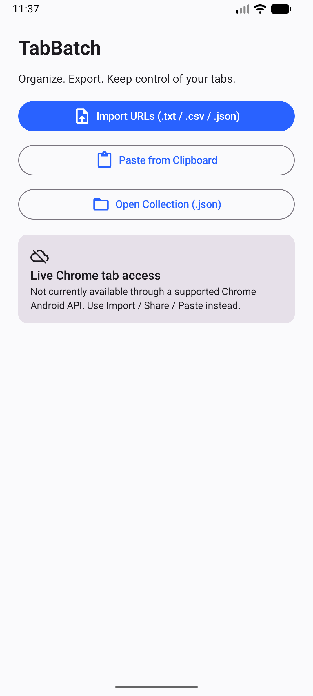
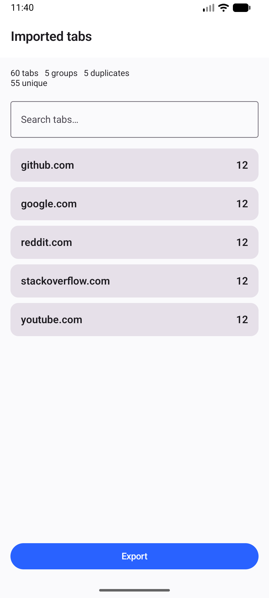
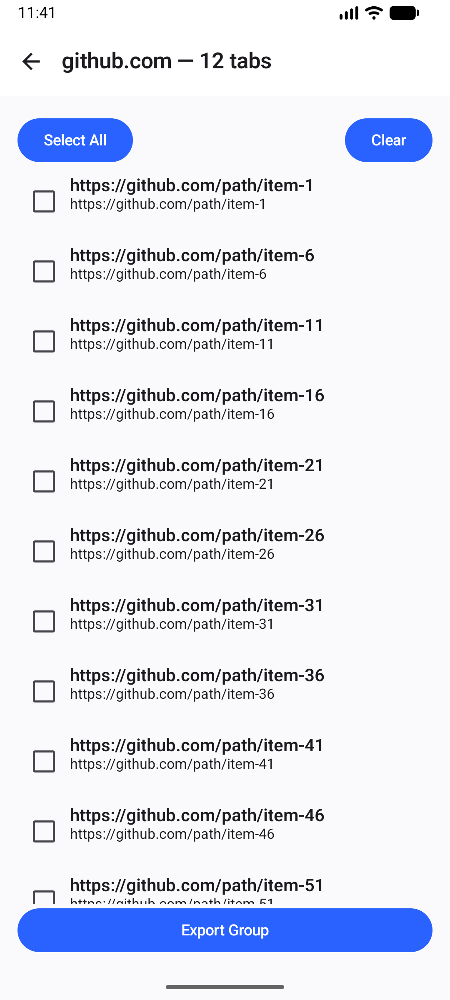
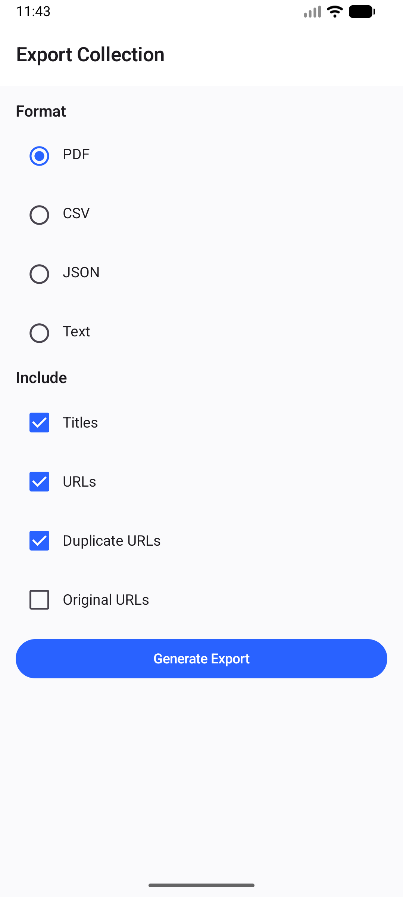

# TabBatch

[](LICENSE)
[](.github/workflows/android.yml)

**Organize large collections of browser tab URLs and export them to PDF, CSV, JSON, or text — locally, on Android.**

## Problem

Opening dozens of pages from the same site on a phone is easy. Doing anything useful with
that collection afterward is not: there's no way to group those tabs by site, spot duplicates,
or get all the links out without switching between tabs and copy-pasting one at a time. A
phone clipboard is not a database for sixty URLs.

TabBatch treats a tab collection as structured data: import it, group it by domain, flag exact
duplicates without deleting them, search/select what you need, and export it to a portable file
you can open with anything.

## Screenshots

Captured on an Android emulator (API 34, 1080x2400) from a 60-URL synthetic demo collection
(5 domains, 5 exact duplicates):

| Home | Collection overview |
|---|---|
|  |  |

| Group detail | Export |
|---|---|
|  |  |

## Features

- **Import** — paste a multiline list of URLs, receive a share (`ACTION_SEND`) from another app,
  or import a `.txt`, `.csv`, or TabBatch-format `.json` file.
- **Normalize** — validates and cleans each URL (trims whitespace, strips accidental wrapping
  quotes, lower-cases scheme/host, converts internationalized hostnames to punycode) without
  rewriting query strings or fragments.
- **Group by domain** — deterministic registrable-domain grouping (e.g. `docs.example.com` and
  `example.com` both group under `example.com`).
- **Detect duplicates** — exact-URL duplicates are flagged, never silently removed; you choose
  whether an export keeps or drops them.
- **Search & select** — filter by title/URL/domain, select whole groups or individual records.
- **Export** — PDF, CSV, JSON (versioned schema), and plain text, all generated on-device.
- **Share** — hand the exported file to any app via the standard Android share sheet.

## Live Chrome tab access is NOT supported — and that's deliberate

**TabBatch cannot read, list, or control the tabs currently open in Chrome for Android**, and it
never will unless Google ships a public API for that. There is no `chrome.tabs`-equivalent
surface exposed to ordinary third-party Android apps, and Chrome for Android does not support
desktop-style browser extensions. Any tool that claims to "connect to your open Chrome tabs" on
stock Android is either using an unsupported private mechanism, or lying.

Because of that, TabBatch is built around three input paths that Android genuinely supports:

1. **Share intent** — select your tabs in Chrome, use Share, pick TabBatch.
2. **Manual paste** — copy a list of URLs and paste it in.
3. **File import** — export a `.txt`/`.csv` from wherever you have one and import it.

The codebase does define a `BrowserTabSource` abstraction (see
[`platform/browser/BrowserTabSource.kt`](app/src/main/java/com/tabbatch/app/platform/browser/BrowserTabSource.kt))
so a real adapter could be added later *if* a supported mechanism ever appears — but the only
implementation shipped today truthfully reports itself as unavailable. See
[`docs/PLATFORM_LIMITATIONS.md`](docs/PLATFORM_LIMITATIONS.md) and
[`docs/ARCHITECTURE_DECISIONS.md`](docs/ARCHITECTURE_DECISIONS.md) (ADR-0001) for the full
rationale.

## Privacy

- No analytics, ads, or telemetry.
- No account, no server, no network calls required for core functionality.
- URLs and titles are processed and stored on-device only.
- Exports only leave the device when you explicitly share them.

## Architecture

```text
UI (Compose)  ->  ViewModel / use cases  ->  Domain (pure Kotlin, JVM-testable)
                                                  |
                                     +------------+------------+
                                     |                         |
                              Data / Persistence         Platform adapters
                                                    (share, clipboard, SAF file I/O)
```

The domain layer (`domain/model`, `domain/normalizer`, `domain/grouping`, `domain/dedup`,
`domain/parser`, `domain/export`) has no dependency on Android framework classes and is unit
tested on the plain JVM. See [`docs/ARCHITECTURE.md`](docs/ARCHITECTURE.md) for details.

## Build & run

Requires JDK 17 and the Android SDK (compileSdk/targetSdk 35, minSdk 26).

```bash
# Windows
gradlew.bat assembleDebug

# macOS / Linux
./gradlew assembleDebug
```

The debug APK is written to `app/build/outputs/apk/debug/app-debug.apk`.

> **Windows checkout path note:** if your checkout path contains non-ASCII characters (accented
> letters, em dashes, etc.), Gradle's test workers can fail with spurious `ClassNotFoundException`
> errors even though the code compiles fine. Building from an ASCII-only path avoids it. See
> [`docs/DEVELOPMENT.md`](docs/DEVELOPMENT.md#a-note-on-non-ascii-checkout-paths-on-windows) for
> the full explanation and a registry-based alternative fix.

## Testing

```bash
gradlew.bat test        # unit tests (domain layer)
gradlew.bat check       # unit tests + lint
```

See [`docs/DEVELOPMENT.md`](docs/DEVELOPMENT.md) for local setup details.

## Roadmap

Not MVP-blocking, tracked as future work:

- Reading-time / URL health checks, domain statistics.
- ZIP export bundling PDF + CSV + JSON.
- Additional browser-specific import adapters (session-file formats).
- Experimental accessibility-service automation spike — evaluated only as future research; see
  [`docs/PLATFORM_LIMITATIONS.md`](docs/PLATFORM_LIMITATIONS.md). Not implemented, and not a
  substitute for an official API.

## Contributing

See [`CONTRIBUTING.md`](CONTRIBUTING.md).

## License

MIT — see [`LICENSE`](LICENSE).
